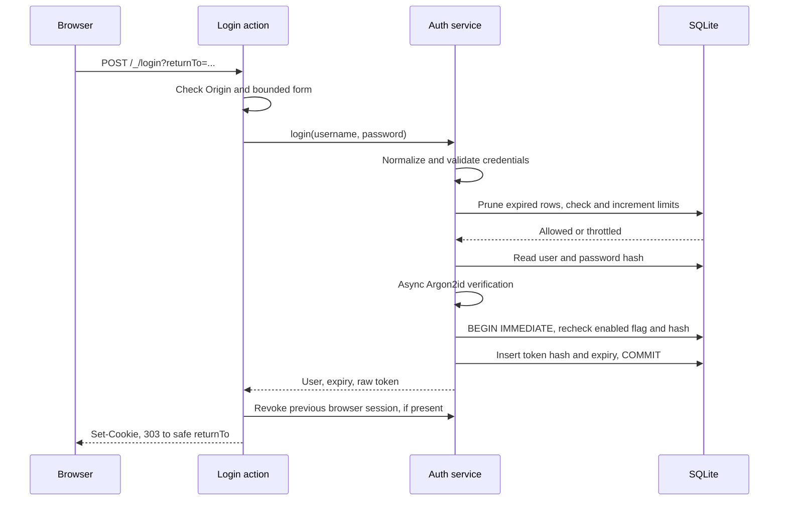
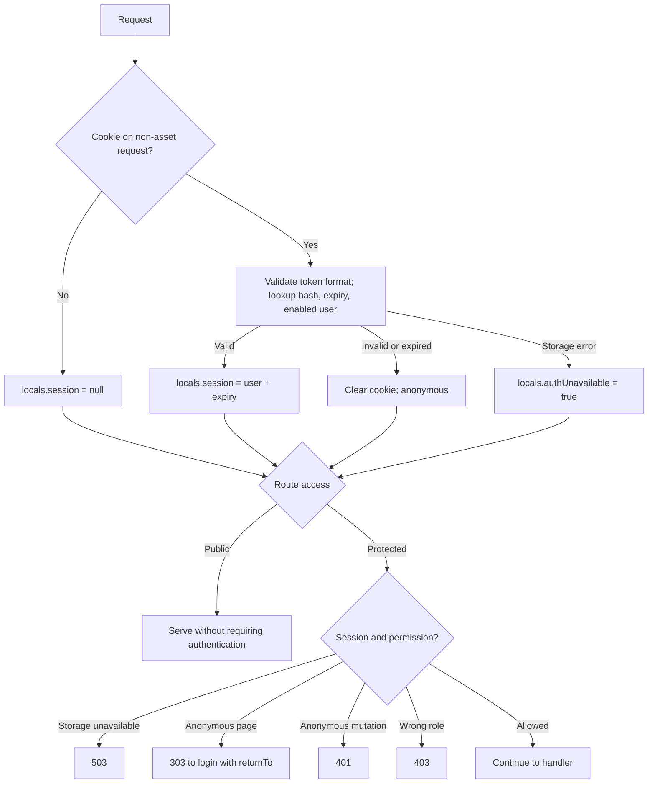

# Authentication

Implemented 2026-09-13. Public reading; local account administration; fixed 30-day
sessions. No signup, browser account management, or password recovery. Editing and
publishing remain authorized placeholders.

## Code boundaries

| Module | Responsibility |
| --- | --- |
| `src/lib/server/auth/index.ts` | Framework-independent credentials, sessions, authorization, account creation/reset |
| `src/lib/server/auth/runtime.ts` | Lazy singleton; private SvelteKit configuration |
| `src/lib/server/auth/http.ts` | Origin checks, bounded forms, return URLs, permission guards |
| `src/hooks.server.ts` | Cookie lookup → `locals.session`, `locals.authUnavailable` |
| `src/lib/server/database/index.ts` | Path validation, SQLite connection, migrations |
| `scripts/accounts.ts` | Interactive bootstrap/create/reset; shared auth service |

## Login



Diagram shows success. Each failed check exits before subsequent operations.

- Require matching `Origin` and URL-encoded body ≤8 KiB; exactly one `login` and
  one `password` field. SvelteKit CSRF protection remains enabled.
- Username: trim + lowercase; `[a-z0-9._-]{3,64}`. Password: 15–128 Unicode code
  points; preserve spaces. Invalid format exits before storage/throttling.
- Argon2id: 64 MiB memory, time cost 2, asynchronous Bun APIs. Unknown usernames
  verify against a lazily generated dummy hash. Unknown, disabled, and incorrect
  credentials share one error message.
- SQLite fixed-window limits: 5 attempts/username/15 minutes; 60 attempts globally/
  minute. Admitted attempts count even when successful; blocked attempts do not
  increment counters. Limits survive restart; windows start on first admission.
- Token: 32 cryptographically random bytes encoded as 64 hex characters. Store
  SHA-256 only. Expiry = issuance + 30 days; no renewal on activity.
- Cookie: `wiki_session`; host-only, `Path=/`, `HttpOnly`, `SameSite=Lax`,
  `Max-Age=2592000`, matching `Expires`; `Secure` on HTTPS.
- `returnTo`: local path ≤2048 characters; reject external/protocol-relative URLs,
  backslashes, controls, malformed encoding, and login/logout loops. Validate up
  to five decoding passes; fallback `/`. GET login redirects existing sessions.
- Native forms and progressive enhancement share the action. Failure retains the
  username, never the password. Raw tokens go only to cookie handling.

## Session lookup and authorization



- `/_/assets/` and `/_/app/` skip lookup. Missing/malformed tokens need no DB read.
  Lookup joins users/sessions and requires `expires_at > now` and `enabled = 1`.
- Layout exposes only `{ id, login, role }`. Non-asset responses use `no-store`.
- Storage lookup failure preserves the cookie, renders public pages anonymously,
  and makes permission guards/login loader return 503. An absent cookie does not
  probe DB health; anonymous protected pages still redirect to login.

| Resource | Access |
| --- | --- |
| Documents, document images, `?files` placeholder | Public |
| `?edit`, Publish, document mutation stubs | Editor or admin |
| Settings and account-management stub | Admin |

`?files` takes precedence over `?edit`. Guards run server-side; hidden navigation
is presentation only. Authorized feature mutations still return 501.

## Revocation and account commands

- POST `/_/logout`: require Origin; delete current token hash; clear cookie; 303
  `/`. Missing/expired sessions are harmless. Storage failure returns 503.
- `bootstrap`: create first admin only if users table is empty, checked inside the
  insertion transaction. `create`: unique normalized login and explicit role.
- `reset-password`: hash first, then atomically update the password and delete all
  user sessions. Login rechecks the verified hash inside its insertion transaction:
  reset before insertion rejects login; reset after insertion deletes that session.
- CLI requires TTY input/output and non-echoed password confirmation. No password
  arguments. Browser account mutation endpoints remain stubs.

```sh
bun run accounts -- bootstrap
bun run accounts -- create alice --role editor
bun run accounts -- reset-password alice
```

## Storage and deployment

| Table | Stored fields |
| --- | --- |
| `users` | `id` PK, `login` UNIQUE, `password_hash`, `role`, `enabled`, `created_at` |
| `sessions` | `token_hash` PK, `user_id` FK → users, `expires_at` |
| `login_limits` | `key` PK (`global` or `user:<login>`), `attempts`, `expires_at` |

Lazy `bun:sqlite` connection; prepared queries; WAL; foreign keys; 5-second busy
timeout; transactional `user_version=1` migration. New files use `0600`, new parent
directories `0700`. Login throttling prunes expired session/limit rows.

Production `DATABASE_PATH` must be absolute and outside `DOCS_DIR` and deployment,
including existing/dangling symlink equivalents. Development defaults to
`./data/wiki.sqlite`. Build preflight validates source and copied production config
before replacement; launcher validates before start. Compilation creates no DB.

Bundled `accounts.js` enforces production paths against its own directory. Run from
deployment with `NODE_ENV=production` to load copied environment files. Runtime uses
`!dev` from `$app/environment`: the adapter can incorrectly inline `NODE_ENV`.
Trusted proxy must overwrite forwarded host/protocol headers; these determine
Origin and Secure-cookie behavior. See [README](../README.md#accounts-and-login)
for production commands and backup/restore.

## Errors and verification

Native HTTP: invalid/missing credentials 400; Origin/permission failure 403;
oversized body 413; unsupported encoding 415; throttling 429 + `Retry-After`;
storage failure 503. Enhanced forms use SvelteKit action-result serialization.
Storage logs omit credentials and configuration.

Implementation baseline: 112 tests, Svelte check, build, and development/production
HTTP smoke passed. Coverage includes non-echoing CLI prompts, reset/login race,
limits, redirects, migration/path safety, proxy cookies, restart persistence, and
public reads during DB failure. Adapter's `bun:sqlite` external-import warning was
verified harmless by production smoke. No deployment performed.
